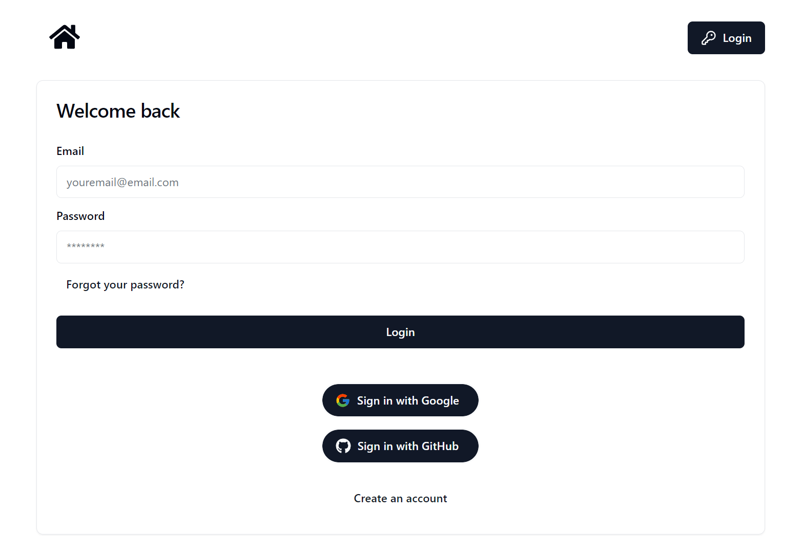

## Service_deployment

This project is built using [Next.js](https://nextjs.org/) and initialized with [`create-next-app`](https://github.com/vercel/next.js/tree/canary/packages/create-next-app). It implements login and sign-up modules using Google and GitHub OAuth for user authentication, along with the Drizzle ORM and Neon database for data management.

### Login page

### Key features
* sign-up and login module with google and github
* drizzle ORM and neon database
* login & sign-up ui

